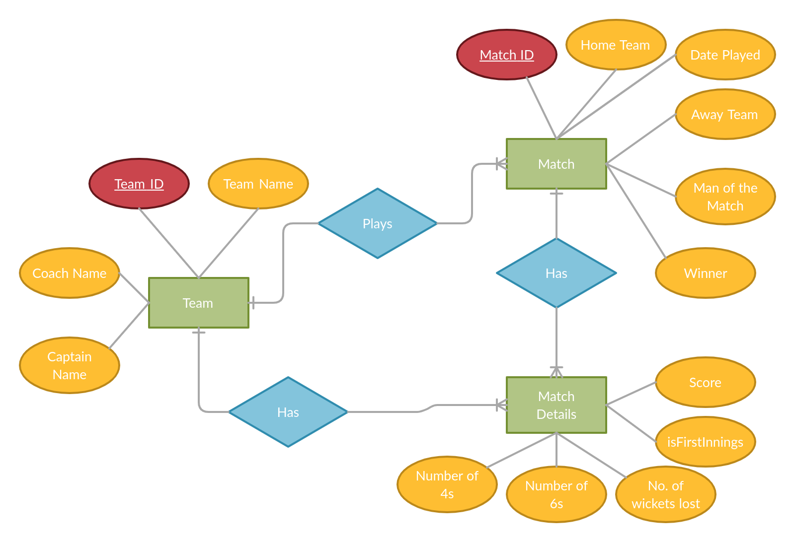
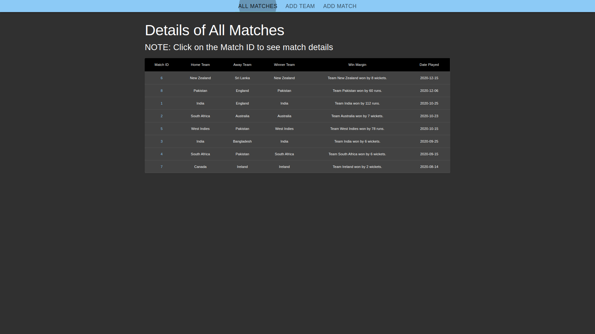
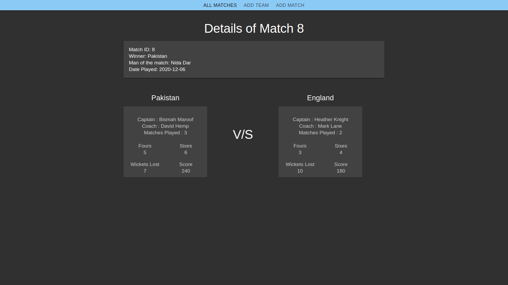
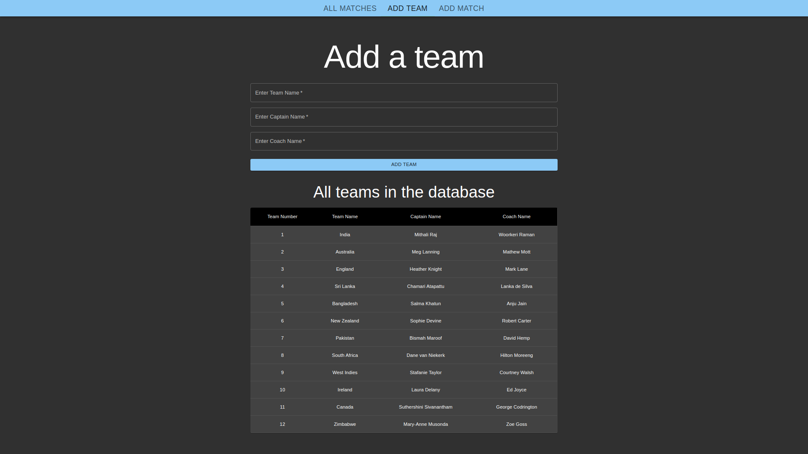
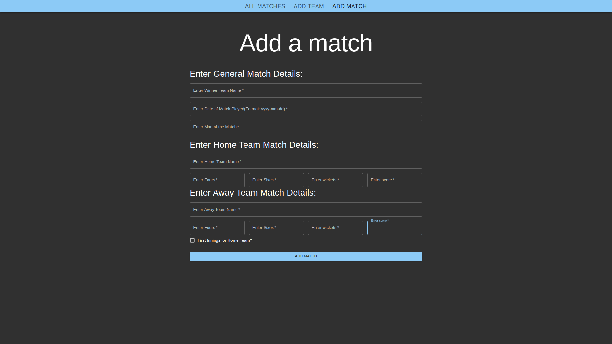

# WCZ Internship Task

## Please load the [cricket.sql](./cricket.sql) file in MySQL using. Make a database named cricket first.

To load the database use:
`
mysql -u root -p cricket < cricket.sql
`

## Please change the credentials and db name in [db.json](./apis/db.json) to run the connection cursor in flask.

## Technology used for making APIs:

    1. Python - v3.8.5
    2. Flask - v1.1.2
    3. mySQL - v8.0.21

## Please check the [requirements.txt](./requirements.txt) file to create a virtualenv to run the back end of the project.

## Technology used for making the UI:

    1. ReactJS

## Note that yarn or npm will be required to start the react development server.

## ER diagram for the database:

</img>

## API endpoints:

#### 1. Add Team to the database: ENDPOINT - http://localhost:5000/addteam/
        Body of POST request - 
        {
            "Team Name": "Ireland",
            "Captain Name": "Laura Delany",
            "Coach Name": "Ed Joyce"
        }

#### 2. Add Match to the database: ENDPOINT - http://localhost:5000/addmatch/

        Body of POST request - 
        {
            "home_team": {
                "team_name": "New Zealand",
                "fours": 5,
                "sixes": 5,
                "wickets": 2,
                "score": 340,
                "isFirstInnings": false
            },
            "away_team":  {
                "team_name": "Sri Lanka",
                "fours": 2,
                "sixes": 9,
                "wickets": 9,
                "score": 222,
                "isFirstInnings": true
            },
            "winner": "New Zealand",
            "man_of_the_match": "Sophie Devine",
            "date": "2020-12-15"
        }

### 3. Get all matches from the database: ENDPOINT - http://localhost:5000/getallmatches/

    Response of the GET request will be of the format - 
    [
        {
            "match_id": 6,
            "home_team": "New Zealand",
            "away_team": "Sri Lanka",
            "winner": "New Zealand",
            "message": "Team New Zealand won by 8 wickets.",
            "date_played": "2020-12-15"
        },
        {
            "match_id": 8,
            "home_team": "Pakistan",
            "away_team": "England",
            "winner": "Pakistan",
            "message": "Team Pakistan won by 60 runs.",
            "date_played": "2020-12-06"
        },
        {
            "match_id": 1,
            "home_team": "India",
            "away_team": "England",
            "winner": "India",
            "message": "Team India won by 112 runs.",
            "date_played": "2020-10-25"
        },
        {
            "match_id": 2,
            "home_team": "South Africa",
            "away_team": "Australia",
            "winner": "Australia",
            "message": "Team Australia won by 7 wickets.",
            "date_played": "2020-10-23"
        },
        {
            "match_id": 5,
            "home_team": "West Indies",
            "away_team": "Pakistan",
            "winner": "West Indies",
            "message": "Team West Indies won by 78 runs.",
            "date_played": "2020-10-15"
        }
    ]
            
### 4. Get a match from the database: ENDPOINT - http://localhost:5000/getmatch/<\<id\>>/

    Response of the GET request will be of the format - 
    {
        "match_id": 1,
        "winner": "India",
        "man_of_the_match": "Mithali Raj",
        "date": "2020-10-25",
        "team1": {
            "team_id": 1,
            "team_name": "India",
            "coach_name": "Woorkeri Raman",
            "captain_name": "Mithali Raj",
            "matches_played": 2,
            "fours": 5,
            "sixes": 3,
            "wickets": 6,
            "score": 250
        },
        "team2": {
            "team_id": 3,
            "team_name": "England",
            "coach_name": "Mark Lane",
            "captain_name": "Heather Knight",
            "matches_played": 2,
            "fours": 4,
            "sixes": 4,
            "wickets": 10,
            "score": 138
        }
    }

### 5. Get all teams from the database: ENDPOINT - http://localhost:5000/getteams/  

    Response of the GET request will be of the format - 
    {
        "team_list": [
            {
                "team_name": "India",
                "coach_name": "Woorkeri Raman",
                "captain_name": "Mithali Raj"
            },
            {
                "team_name": "Australia",
                "coach_name": "Mathew Mott",
                "captain_name": "Meg Lanning"
            },
            {
                "team_name": "England",
                "coach_name": "Mark Lane",
                "captain_name": "Heather Knight"
            },
            {
                "team_name": "Sri Lanka",
                "coach_name": "Lanka de Silva",
                "captain_name": "Chamari Atapattu"
            },
            {
                "team_name": "Bangladesh",
                "coach_name": "Anju Jain",
                "captain_name": "Salma Khatun"
            },
            {
                "team_name": "New Zealand",
                "coach_name": "Robert Carter",
                "captain_name": "Sophie Devine"
            },
            {
                "team_name": "Pakistan",
                "coach_name": "David Hemp",
                "captain_name": "Bismah Maroof"
            },
            {
                "team_name": "South Africa",
                "coach_name": "Hilton Moreeng",
                "captain_name": "Dane van Niekerk"
            }
        ]
    }

## Snippets of the front end: 

### 1. All Match API
</img>

### 2. Match Detail API
</img>

### 3. Add team API
</img>

### 4. Add match API
</img>